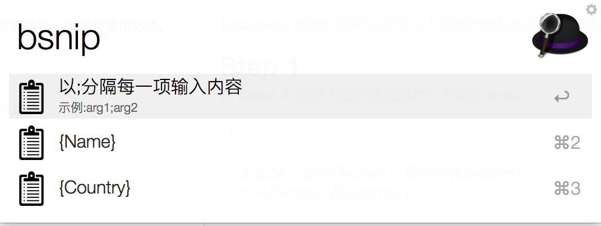
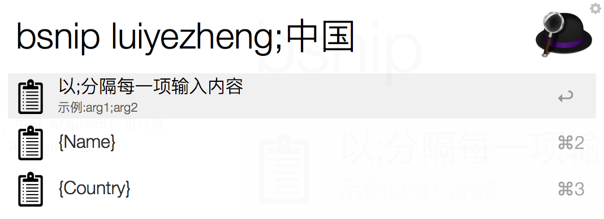
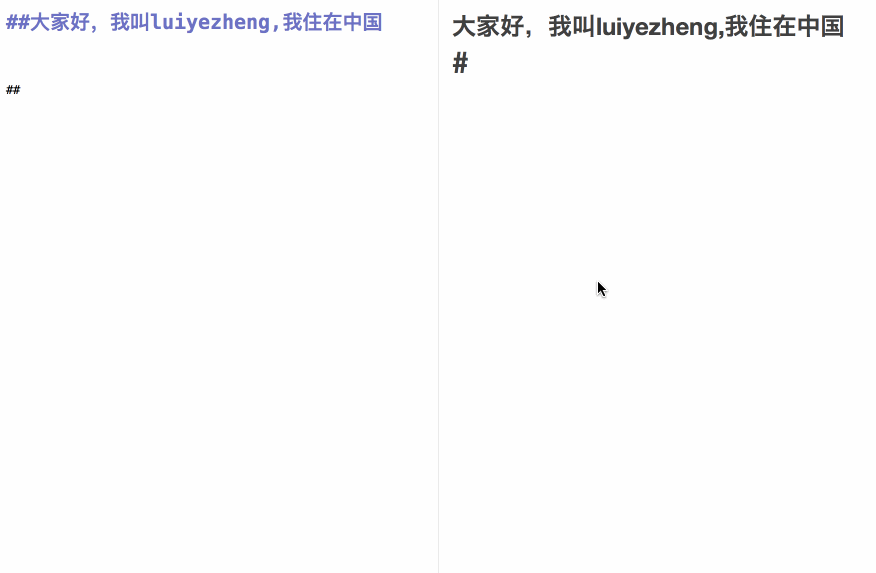

如果你用过 aText 或者 TextExpander 之类的应用，你可能知道 fill in 这个功能。就是你预存的 snip 中一些部分是可编辑的，当你插入这条 snip 的时候，输入对应部分内容，得到完整的文本。

比如下面这个例子，「我是（），我住在（）」。当你插入这条 snip 的时候，你只需输入姓名、地址，即可得到完整的文本「我是XXX，我住在XXX」。

BetterSnip 这款扩展可以实现与上面说的类似的功能。下面是使用方法。

**注意，由于 BetterSnip 是基于 Alfred 原生的 snippets ，所以 Alfred clipboard 高级设置中的「Auto Paste on return」不能勾选。**

**也就是说，不能自动把所选内容粘贴到当前应用程序中了，而多了一个「Command + V」粘贴的步骤。**

##Step 1

在 Alfred 中按照下面的格式添加一个新的 snip。

>
大家好，我叫{Name}，我住在{Country}

><<<{Name};{Country}>>>

也就是把你需要替换的内容用{argument}表示，中间 argument 可以填写任何内容（不建议使用中文），但注意不能与 Alfred 中原有的{date}、{clipboard}冲突。

##Step 2
像正常使用 Alfred 中的 snip 一样，把你想要的 snip 复制到剪贴板。

##Step 3
在 Alfred 中输入「bsnip」，会看到下图中的内容。

提示会告诉你需要输入哪些内容，比如这里是{Name}、{Country}，也就是之前我们添加的那条 snip。

好了，现在输入你想输入的内容就可以了，不同内容间用「;」分隔

最后，按下回车，再按下「Command + V」，就可以得到我们需要的文本了。

##更快捷的用法
如果你能记得 snip 的名称，那么你可以直接使用「hbsnip + snip关键词」，免去了先打开 Alfred snippet 的过程。

请看下面的 GIF 演示。

