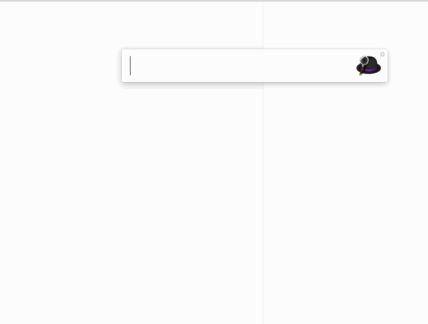
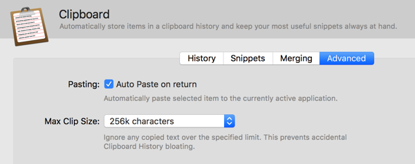
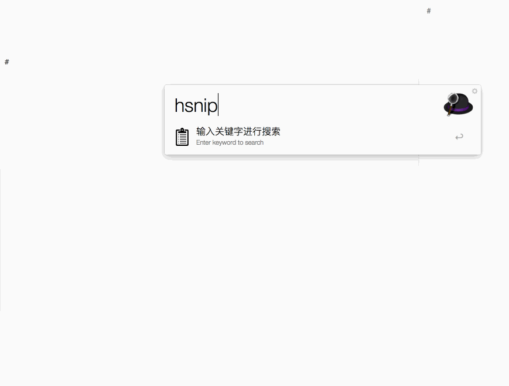

#BetterSnip V2.0 相比 V1.0 有哪些重要改进

**V2.0 的改进主要在使用体验和易用性两个方面,它更加简洁也更加优雅**

###直接可以对 snip 进行搜索

在上一个版本中，必须要准确得记忆预存 snip 的 keyword。或是先从 Alfred 的 snippet 中找到需要的 snip，并复制到剪贴板，然后再通过 BetterSnip 进行操作。

而在 V2.0 中，你可以进行搜索了，找到你想要的 snip ，按下回车键，开始输入要填充的内容吧。

###现在你可以勾选 Alfred 中的自动粘贴选项了

##对普通 snip 的支持
V2.0 支持普通的没有填充项的 snip

##BetterSnip 是否可以取代 Alfred 内置的 snip 功能？
目前来看还不可以，BetterSnip 不支持对 snip 预览，此外，BetterSnip 的搜索功能还不够完善。

##未来的计划
我会继续对搜索功能进行完善，并看看有没有办法实现对 snip 的预览。此外，我可能会在近期，加入直接通过 Alfred 窗口添加新 snip 的功能，敬请期待。

